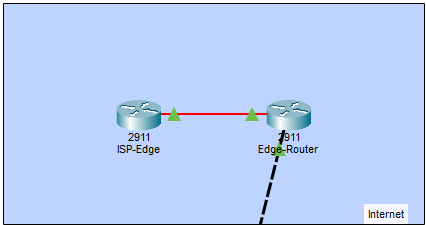
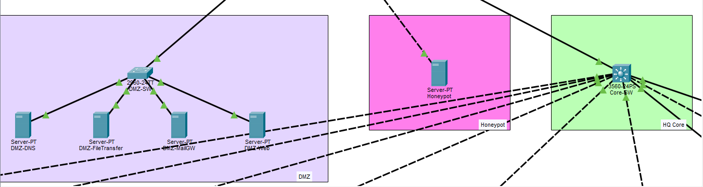
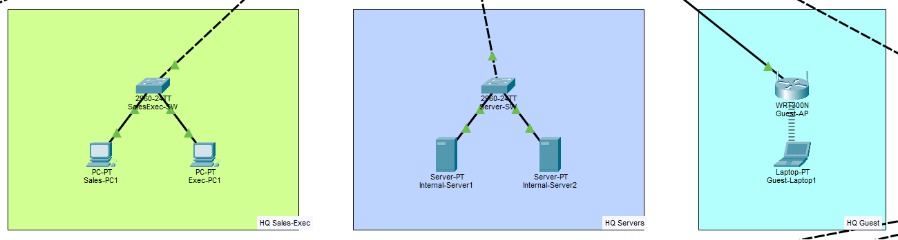
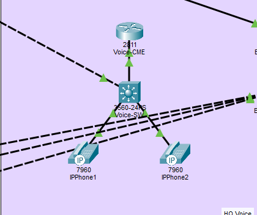

# Enterprise Multi-Site Network with Security Segmentation

## Project Overview

This Cisco Packet Tracer project models a segmented enterprise network
with headquarters infrastructure, Internet connectivity, perimeter
security, a DMZ, internal network segments, guest wireless access,
VoIP infrastructure, and remote/multi-site connectivity.

The project was designed to provide hands-on experience with enterprise
network architecture and the separation of systems based on their
roles and security requirements.

## Network Architecture

The network is divided into multiple functional areas, including:

- Internet / WAN
- HQ perimeter
- DMZ
- HQ core
- Internal servers
- Sales / Executive network
- Guest wireless network
- Voice network
- Honeypot environment
- Additional enterprise and remote network segments

---

## Internet and HQ Perimeter

Internet connectivity is represented using Cisco 2911 routers.

The perimeter contains:

- ISP-Edge router
- Edge-Router
- Cisco ASA 5506-X HQ firewall

The firewall is positioned between the external network infrastructure
and the headquarters environment.

This architecture creates a security boundary between external and
internal network resources.

---

## DMZ

A dedicated DMZ contains externally facing services separated from the
main internal network.

The DMZ includes:

- DNS server
- File transfer server
- Mail gateway
- Web server
- Cisco 2960 DMZ switch

Separating public-facing services from internal systems helps reduce
the exposure of the internal enterprise network.

---

## Honeypot

The topology includes a dedicated honeypot system separated from the
main server environment.

The honeypot represents a cybersecurity monitoring component that can
be used to observe or study suspicious activity without placing normal
production systems in the same role.

---

## HQ Core Network

A Cisco 3560 multilayer switch serves as part of the headquarters core
infrastructure and connects multiple enterprise network segments.

The core provides connectivity between the different functional areas
of the headquarters environment.

---

## Internal Servers

Internal enterprise services are separated from the DMZ infrastructure.

The server segment contains:

- Server-SW
- Internal-Server1
- Internal-Server2

This separation demonstrates the distinction between internal resources
and externally facing services.

---

## Sales and Executive Network

A separate network area contains Sales and Executive workstations.

Devices include:

- SalesExec-SW
- Sales-PC1
- Exec-PC1

This design demonstrates segmentation of enterprise endpoints according
to their organizational function.

---

## Guest Wireless Network

The network includes a separate guest wireless environment consisting of:

- WRT300N Guest-AP
- Guest-Laptop1

The guest network represents wireless connectivity intended to remain
logically separated from normal corporate resources.

---

## Voice Network

The enterprise topology also includes dedicated VoIP infrastructure.

The voice environment contains:

- Cisco 2911 Voice-CME router
- Cisco 3560 Voice-SW
- Cisco 7960 IP phones

This portion of the topology demonstrates how voice infrastructure can
be incorporated into an enterprise network separately from normal
workstation traffic.

---

## Security Architecture

The topology incorporates multiple security-oriented design concepts:

- Perimeter firewall
- DMZ separation
- Internal server separation
- Guest network separation
- Departmental segmentation
- Dedicated honeypot
- Separate voice infrastructure
- Internet edge architecture

These components demonstrate a layered approach to enterprise network
design rather than placing every device on a single flat network.

---

## Technologies Used

- Cisco Packet Tracer
- Cisco 2911 Routers
- Cisco ASA 5506-X Firewall
- Cisco 2960 Switches
- Cisco 3560 Multilayer Switches
- WRT300N Wireless Router
- Cisco 7960 IP Phones
- IPv4 Networking
- LAN / WAN Networking
- DMZ Architecture
- Network Segmentation
- Wireless Networking
- VoIP
- Enterprise Network Design

---

## Skills Demonstrated

- Enterprise network architecture
- Network segmentation
- Perimeter security design
- DMZ architecture
- Cisco router configuration
- Cisco switch configuration
- Firewall integration
- Internal and external service separation
- Guest network design
- VoIP network design
- Multi-site networking
- Network troubleshooting
- Cisco Packet Tracer

---

## Packet Tracer File

The Cisco Packet Tracer project file is included in the
`packet-tracer` directory for review of the complete topology and
device configurations.

---

## What I Learned

This project provided hands-on experience designing a larger enterprise
network with multiple functional and security zones.

I practiced separating public-facing services, internal servers,
employee networks, guest wireless devices, voice infrastructure, and
security systems rather than placing all devices within a single flat
network.

The project also reinforced the importance of perimeter security,
network segmentation, structured enterprise architecture, and
systematic network testing.
